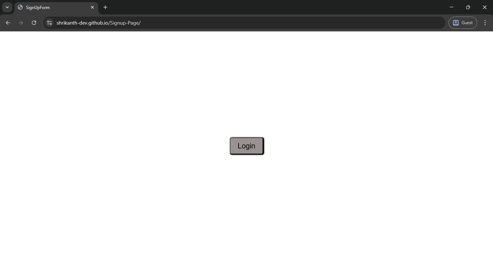
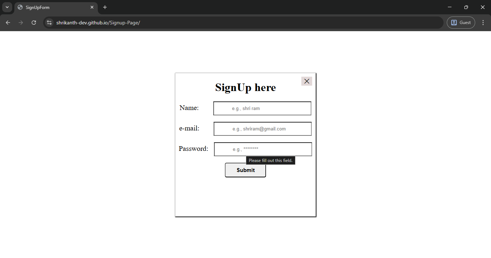

# Registration Form with Validation

## Table of contents

- [Overview](#overview)
  - [The challenge](#the-challenge)
  - [Screenshot](#screenshot)
  - [Links](#links)
  - [Built with](#built-with)
- [Author](#author)

## Overview

A modal SignUp form with open/close animations, using HTML, CSS, and JavaScript. It includes:
- Click "Login" to open modal
- Close button to hide modal
- Clean, responsive design

### The challenge

- Build a modal signup form with open/close interactions
- Add a clean layout for form fields
- Ensure it is responsive and accessible

### Screenshot

### Links

- Solution URL: [solution URL](https://github.com/shrikanth-dev/Signup-Page)
- Live Site URL: [live site URL](https://shrikanth-dev.github.io/Signup-Page/)

### Built with

- HTML5
- CSS3
- JavaScript (Vanilla)

## Author

- Frontend Mentor - [@shrikanth-dev]
- LinkedIn - [@G Srikanth](https://www.linkedin.com/in/g-srikanth-gs)
